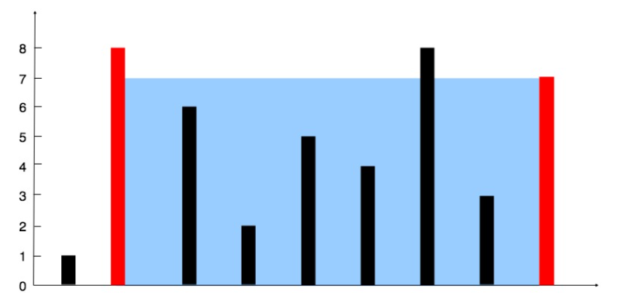

# 盛最多水的容器

给你 n 个非负整数 a1，a2，...，an，每个数代表坐标中的一个点 (i, ai) 。在坐标内画 n 条垂直线，垂直线 i 的两个端点分别为 (i, ai) 和 (i, 0)。找出其中的两条线，使得它们与 x 轴共同构成的容器可以容纳最多的水。

说明：你不能倾斜容器，且 n 的值至少为 2。



图中垂直线代表输入数组 [1,8,6,2,5,4,8,3,7]。在此情况下，容器能够容纳水（表示为蓝色部分）的最大值为 49。

 

示例：

输入：[1,8,6,2,5,4,8,3,7]
输出：49


# 方法1

暴力遍历(枚举) 时间复杂度$O(n^2)$


这里要注意边界条件，当在i循环时，<strong style="color:blue;">i不能循环到数组最后一个，所以为 array.length - 1</strong>。

同样的，<strong style="color:blue;">j在循环时，永远在i的右侧，所以j的起始条件是j  = i +1</strong>; 

在for循环时，第一个为起始条件，第二个为条件，<strong style="color:red;">第三部分为步长，i++和++i是一样的操作</strong>

```java
int max = 0;
for (int i = 0; i < array.length - 1; i++) {
    for (int j = i + 1; j < array.length; j++) {
        max = Math.max(max, (j - i) * Math.min(array[i], array[j]));
        System.out.println("i=" + i + ",j=" + j + ",max=" + max);
    }
}
```

# 方法2

**指针每一次移动，都意味着排除掉了一个柱子**。

1. i = 0 代表第一个木板，j = a.lenth -1 代表最后一个木板。
2. 每次循环后，看i代表的木板和J代表的木板，哪个最小。最小的需要向中间移动。来获取更高的木板。
3. <strong style="color:blue;">宽度是逐渐减小的，要获取最大 的容量，那么就只能获取更高的木板。否则容量只会更小</strong>。


```java
public int maxArea(int[] a) {
        int max = 0;
        for (int i = 0, j = a.length - 1; i < j; ) {
            int minHgight = a[i] < a[j] ? a[i++] : a[j--];
            int area = (j - i + 1) * minHgight;
            max = Math.max(max, area);
        }
        return max;
    }
```

