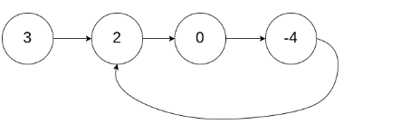
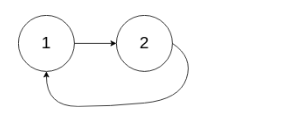
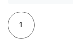

# 环形链表

1. 给定一个链表，判断链表中是否有环。

   为了表示给定链表中的环，我们使用整数 pos 来表示链表尾连接到链表中的位置（索引从 0 开始）。 如果 pos 是 -1，则在该链表中没有环。

    

   示例 1：

   输入：head = [3,2,0,-4], pos = 1
   输出：true
   解释：链表中有一个环，其尾部连接到第二个节点。

   


   示例 2：

   输入：head = [1,2], pos = 0
   输出：true
   解释：链表中有一个环，其尾部连接到第一个节点。

   


   示例 3：

   输入：head = [1], pos = -1
   输出：false
   解释：链表中没有环。

   

   来源：力扣（LeetCode）
   链接：https://leetcode-cn.com/problems/linked-list-cycle
   著作权归领扣网络所有。商业转载请联系官方授权，非商业转载请注明出处。


## 哈希表O(N)


```java
public boolean hasCycle(ListNode head) {
    Set<ListNode> nodesSeen = new HashSet<>();
    while (head != null) {
        if (nodesSeen.contains(head)) {
            return true;
        } else {
            nodesSeen.add(head);
        }
        head = head.next;
    }
    return false;
}

作者：LeetCode
链接：https://leetcode-cn.com/problems/linked-list-cycle/solution/huan-xing-lian-biao-by-leetcode/
来源：力扣（LeetCode）
著作权归作者所有。商业转载请联系作者获得授权，非商业转载请注明出处。
```


## 快慢指针

```java
public boolean hasCycle(ListNode head) {
    if (head == null || head.next == null) {
        return false;
    }
    ListNode slow = head;
    ListNode fast = head.next;
    while (slow != fast) {
        if (fast == null || fast.next == null) {
            return false;
        }
        slow = slow.next;//慢走一步
        fast = fast.next.next;//快走两步,快的绕着慢的转
    }
    return true;
}

作者：LeetCode
链接：https://leetcode-cn.com/problems/linked-list-cycle/solution/huan-xing-lian-biao-by-leetcode/
来源：力扣（LeetCode）
著作权归作者所有。商业转载请联系作者获得授权，非商业转载请注明出处。
```


