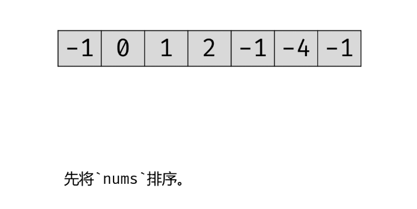
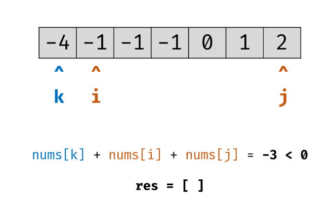
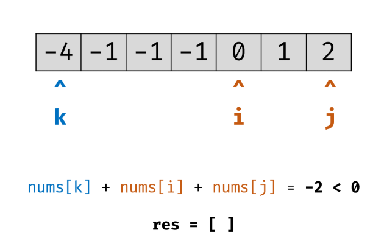
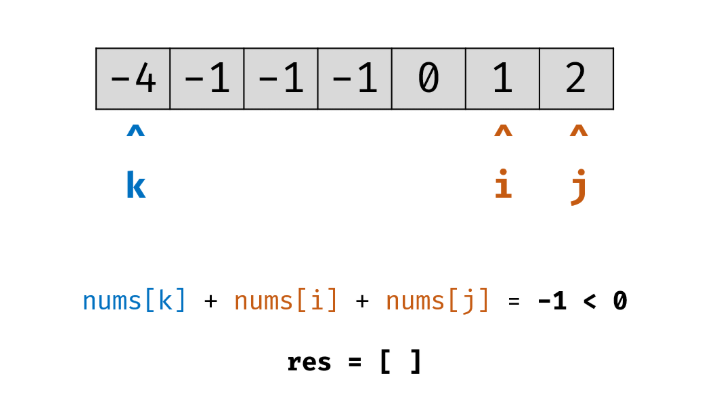
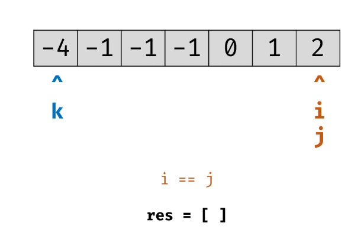
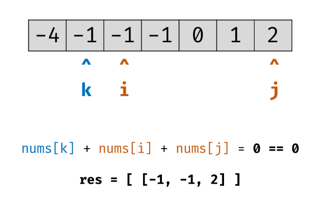
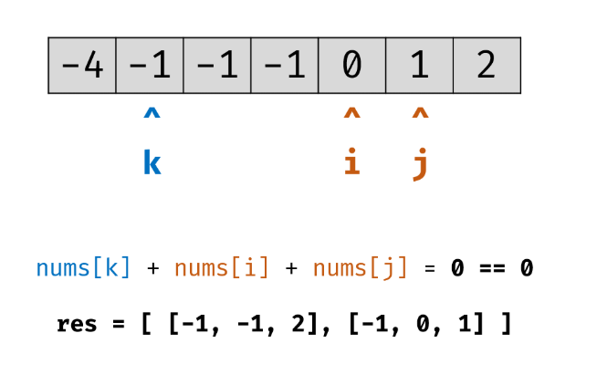
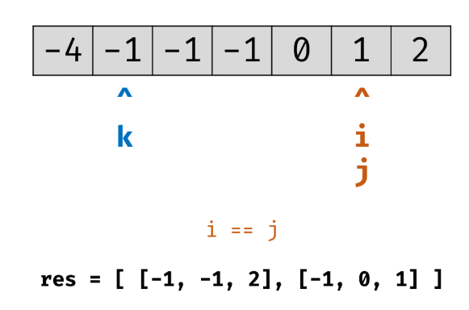
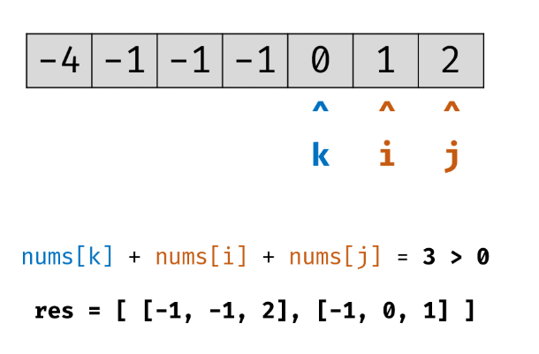
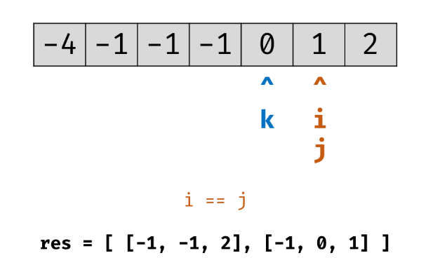

# 三数之和

给你一个包含 n 个整数的数组 nums，判断 nums 中是否存在三个元素 a，b，c ，使得 a + b + c = 0 ？请你找出所有满足条件且不重复的三元组。

注意：答案中不可以包含重复的三元组。

 

#### 示例：

给定数组 nums = [-1, 0, 1, 2, -1, -4]，

满足要求的三元组集合为：
[
  [-1, 0, 1],
  [-1, -1, 2]
]

来源：力扣（LeetCode）
链接：https://leetcode-cn.com/problems/3sum
著作权归领扣网络所有。商业转载请联系官方授权，非商业转载请注明出处。


# 暴力法搜索 $O(n^3)$

暴力解法：

- 注意这里的边界条件<strong style="color:red;">,i = 0 ,j= i+1,k= j+1</strong>.当时在写的时候因为写的k= i+2导致j和k重叠。

```java
public List<List<Integer>> threeSum(int[] nums) {
        if (nums == null || nums.length <= 2) {
            return Collections.emptyList();
        }
        Arrays.sort(nums);//这里的排序写不写都可以
        Set<List<Integer>> result = new LinkedHashSet<>();

        for (int i = 0; i < nums.length - 2; i++) {
            for (int j = i + 1; j < nums.length - 1; j++) {
                for (int k = j + 1; k < nums.length; k++) {
                    if (nums[i] + nums[j] + nums[k] == 0) {
                        List<Integer> list = new ArrayList<>();
                        list.addAll(Arrays.asList(nums[i], nums[j], nums[k]));
                        list.sort(Integer::compareTo);//这里的排序一定要写
                        result.add(list);
                    }
                }
            }
        }
        return new ArrayList<>(result);
    }
```


# 题解2

两重暴力+hash

# 夹逼*O*(*N**l**o**g**N*)

夹逼























```java
class Solution {
    public List<List<Integer>> threeSum(int[] nums) {
        if (nums == null || nums.length <= 2) {
            return Collections.emptyList();
        }
        
        Arrays.sort(nums);
        List<List<Integer>> res = new ArrayList<>();
        for(int k = 0; k < nums.length - 2; k++){
            if(nums[k] > 0) break;
            if(k > 0 && nums[k] == nums[k - 1]) continue;//去除k的重复
            int i = k + 1, j = nums.length - 1;
            while(i < j){
                int sum = nums[k] + nums[i] + nums[j];
                if(sum < 0){
                    while(i < j && nums[i] == nums[++i]);
                } else if (sum > 0) {
                    while(i < j && nums[j] == nums[--j]);
                } else {
                    res.add(new ArrayList<Integer>(Arrays.asList(nums[k], nums[i], nums[j])));
                    while(i < j && nums[i] == nums[++i]);
                    while(i < j && nums[j] == nums[--j]);
                }
            }
        }
        return res;
    }
}

作者：jyd
链接：https://leetcode-cn.com/problems/3sum/solution/3sumpai-xu-shuang-zhi-zhen-yi-dong-by-jyd/
来源：力扣（LeetCode）
著作权归作者所有。商业转载请联系作者获得授权，非商业转载请注明出处。
```

