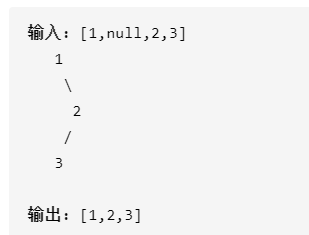

# 二叉树的前序遍历

给定一个二叉树，返回它的 *前序* 遍历。




# 递归

```java
class Solution {
    List<Integer> result = new ArrayList<>();

    public List<Integer> preorderTraversal(TreeNode root) {
        if(root == null)return result;
        result.add(root.val);
        preorderTraversal(root.left);
        preorderTraversal(root.right);
       
    }
}
```

# 栈

```java
public List<Integer> preorderTraversal(TreeNode root) {
        List<Integer> list = new ArrayList<>();
        Stack<TreeNode> stack = new Stack<>();
    //先将root压入栈，初始化这个栈完成。只要栈里不为空，就弹出一个元素
        stack.push(root);
        while (!stack.isEmpty()) {
            TreeNode current = stack.pop();
            if(current != null) { 
                //前序，根左右。但是栈是先进后出。所以先将右节点压入栈，再将左节点压入栈
                list.add(current.val);
                if (current.right != null) stack.push(current.right);
                if (current.left != null) stack.push(current.left);
            }
        }
        return list;
    }
```

