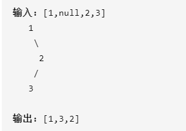

# 二叉树的中序遍历

给定一个二叉树，返回它的*中序* 遍历。

#### **示例:**




# 递归

```java
class Solution {
    List<Integer> list = new ArrayList();
    public List<Integer> inorderTraversal(TreeNode root) {
        if(root == null) return list;
        inorderTraversal(root.left);
        list.add(root.val);
        inorderTraversal(root.right);
    }
}
```


# 栈

```java
public static void inOrderIteration(TreeNode head) {
	if (head == null) {
		return;
	}
	TreeNode cur = head;
	Stack<TreeNode> stack = new Stack<>();
	while (!stack.isEmpty() || cur != null) {
        //把左子树全部压入栈
		while (cur != null) {
			stack.push(cur);
			cur = cur.left;
		}
        //取出最左侧的一点Node(最小的点)
		TreeNode node = stack.pop();
        //访问当前节点
		System.out.print(node.value + " ");
        //访问右节点
		if (node.right != null) {
			cur = node.right;
		}
	}
}

作者：gre-z
链接：https://leetcode-cn.com/problems/binary-tree-preorder-traversal/solution/leetcodesuan-fa-xiu-lian-dong-hua-yan-shi-xbian-2/
来源：力扣（LeetCode）
著作权归作者所有。商业转载请联系作者获得授权，非商业转载请注明出处。
```

